# Описание сути лабораторной работы

В рамках лабораторной нужно имитировать контейнеризацию, по факту создав свой Docker. Необходимо запустить процесс без изоляции, потом навесить на него namespaces, ограничения ресусрсов и урезание прав. Все команды надо собрать в один скрипт (это будет Docker), сравню свой Docker с настоящим запуском `docker run`.

# Ход работы
## Подготовка
До сегодняшнего дня я был активным пользователем Windows, иногда заходил на Linux: был пользователем Ubuntu, Arch. Чтобы не делить диск, купил новый ssd диск, установил его в пк и загрузил Ubuntu, решил не усложнять себе жизнь. Установил необходимые утилиты для работы.

## Часть 0 - свой сервис
Написал (сгенерировал) свой сервис на Go с 3 эндпоинтами : 
- `GET /health` — возвращает `ok`;
- `GET /eat?mb=N` — выделяет N мегабайт памяти и держит их;
- `GET /burn` — нагружает одно ядро CPU в бесконечном цикле.

## Часть 1 - прямой запуск
запустил сервис напрямую без ограничений. `/health` возвращает `ok`

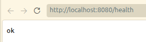

запустил `ps` и получил точку отсчета, с которой буду сравнивать данные полученные после наложения изоляции. 
``` bash
ps -p 10204 -o pid, ppid,user,cmd
    PID    PPID USER     CMD
  10204    6627 tim      ./api
```
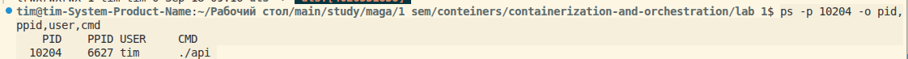

запустил `ls -l /proc/$(pgrep api)/ns/` и `ls -l /proc/$$/ns/`
``` bash
pgrep -a api
ls -l /proc/$(pgrep api)/ns/ # namespace сервиса
ls -l /proc/$$/ns/ # namespace моей shell
10204 ./api
total 0
lrwxrwxrwx 1 tim tim 0 Sep 18 09:17 cgroup -> 'cgroup:[4026531835]'
lrwxrwxrwx 1 tim tim 0 Sep 18 09:17 ipc -> 'ipc:[4026531839]'
lrwxrwxrwx 1 tim tim 0 Sep 18 09:17 mnt -> 'mnt:[4026531832]'
lrwxrwxrwx 1 tim tim 0 Sep 18 09:17 net -> 'net:[4026531833]'
lrwxrwxrwx 1 tim tim 0 Sep 18 09:17 pid -> 'pid:[4026531836]'
lrwxrwxrwx 1 tim tim 0 Sep 18 09:17 pid_for_children -> 'pid:[4026531836]'
lrwxrwxrwx 1 tim tim 0 Sep 18 09:17 time -> 'time:[4026531834]'
lrwxrwxrwx 1 tim tim 0 Sep 18 09:17 time_for_children -> 'time:[4026531834]'
lrwxrwxrwx 1 tim tim 0 Sep 18 09:17 user -> 'user:[4026531837]'
lrwxrwxrwx 1 tim tim 0 Sep 18 09:17 uts -> 'uts:[4026531838]'
total 0
lrwxrwxrwx 1 tim tim 0 Sep 18 09:16 cgroup -> 'cgroup:[4026531835]'
lrwxrwxrwx 1 tim tim 0 Sep 18 09:16 ipc -> 'ipc:[4026531839]'
lrwxrwxrwx 1 tim tim 0 Sep 18 09:16 mnt -> 'mnt:[4026531832]'
lrwxrwxrwx 1 tim tim 0 Sep 18 09:16 net -> 'net:[4026531833]'
lrwxrwxrwx 1 tim tim 0 Sep 18 09:16 pid -> 'pid:[4026531836]'
lrwxrwxrwx 1 tim tim 0 Sep 18 09:16 pid_for_children -> 'pid:[4026531836]'
lrwxrwxrwx 1 tim tim 0 Sep 18 09:16 time -> 'time:[4026531834]'
lrwxrwxrwx 1 tim tim 0 Sep 18 09:16 time_for_children -> 'time:[4026531834]'
lrwxrwxrwx 1 tim tim 0 Sep 18 09:16 user -> 'user:[4026531837]'
lrwxrwxrwx 1 tim tim 0 Sep 18 09:16 uts -> 'uts:[4026531838]'
```
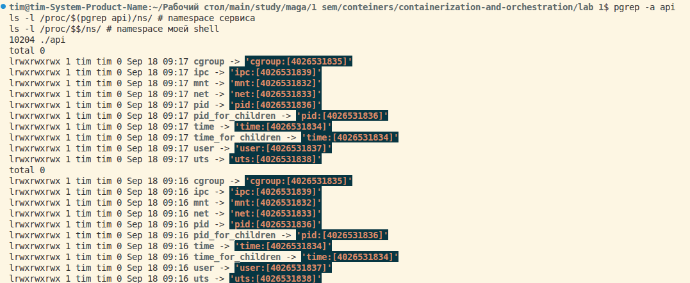

сравнил полученные результаты для понимания, что это неизолированный процесс на данный момент. Такой вывод сделал из того, что у одних и тех же namespace сервиса и моей shell одни и те же inode. 

## Часть 2 - namespaces
Создал новый набор namespace и зашёл внутрь:
``` bash 
unshare --pid --mount --net --uts --ipc --user --map-root-user --fork bash
```
Внутри переделал `/proc` (`mount -t proc proc /proc`), чтобы `ps` читал процессы нового pid-ns, а не тот, который унаследован от хостового.
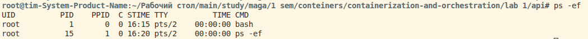
внутри pid bash стал равен 1

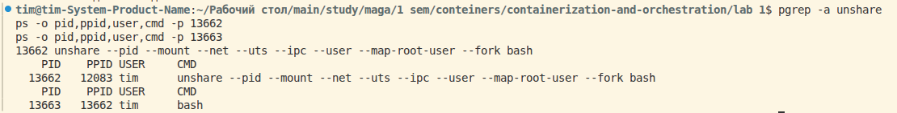
снаружи pid не равен 1

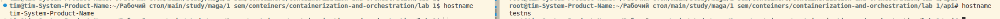
поменял hostname внутри, он поменялся только внутри, а снаружи hostname остался тем же. 

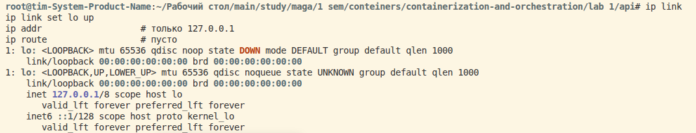
внутри нового пространства net-ns есть только lo и он в состоянии down. После его поднятия в адресах есть только localhost, а ip route пусто.

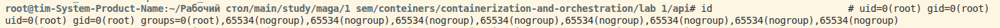
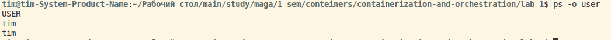
внутри `uid=0(root)`, снаружи `tim`

| Namespace | Часть 1 (хост) | Часть 2 (внутри) | Изменился? |
|-----------|----------------|------------------|------------|
| mnt       | 4026531832     | 4026534462       | да         |
| pid       | 4026531836     | 4026534465       | да         |
| net       | 4026531833     | 4026534466       | да         |
| uts       | 4026531838     | 4026534463       | да         |
| ipc       | 4026531839     | 4026534464       | да         |
| user      | 4026531837     | 4026533309       | да         |
| cgroup    | 4026531835     | 4026531835       | нет        |

В прошлой части фиксировал inode namespece'ов, сейчас решил сравнить их с текущими inode. 6 из 7 разошлись. Это значит, что изоляция работает. 

## Часть 6 - Образы
Создал контейнер на основе Dockerfile
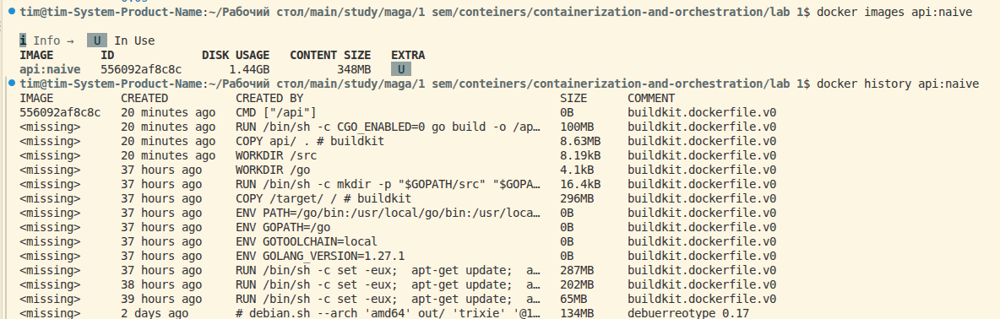
Контейнер включает в себя много ненужных штук (ОС Debian, тулчейны Go, исходники стандартных библиотек), которые занимают много места. Бинарнику не нужны все эти файлы. 

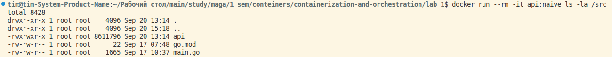
внутри контейнера лежат все файлы, из которых компилируется бинарник, это неправильно. 

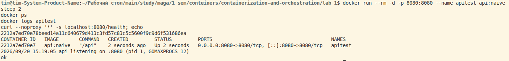
запустил и проверил, что сервис работает. 

сделал multi-stage-сборку из Dockerfile.slim
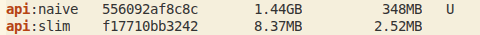
сравниваю размер обычной и multi-stage-сборок

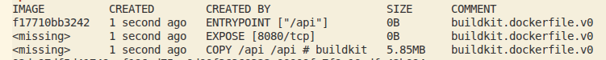
слои, которые остались в multi-stage-сборке

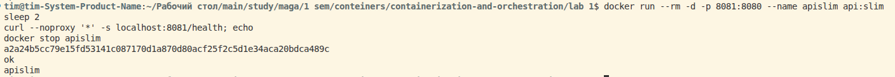
multi-stage-сборка работает и запускается

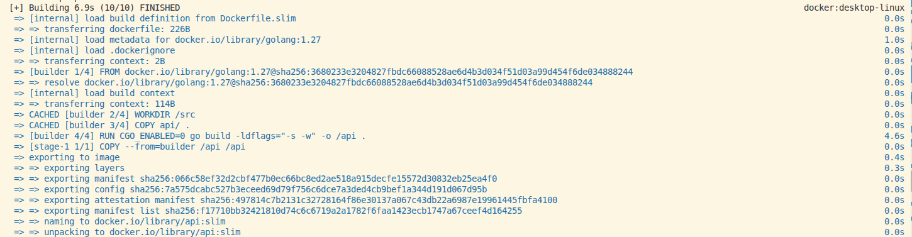
в процессе multi-stage-сборки видно, что 2 строки были взяты из кэша. Это происходит из-за того, что докер может брать предыдущие операции не только из этой же сборки, но и из других сборок, если они идентичны. Так как папка api никак не поменялась между двумя сборками, то ее копирование не происходит. 
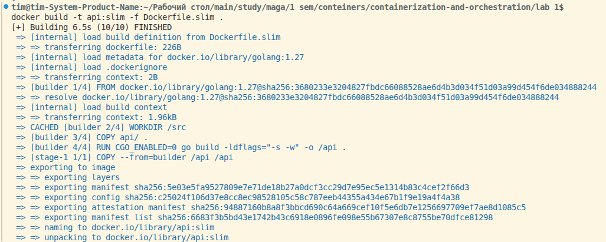
добавил в main.go комментарий для проверки того, как работает cashe при сборке. На скриншоте видно, как заново собирается `COPY apy/ .`, а не берется из cashe.

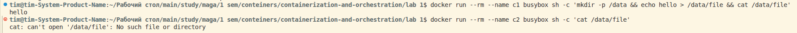
при записи чего-либо внутрь контейнера, этого не будет видно в контейнере после его пересоздания. 

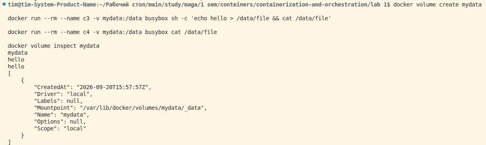
при записи внутрь тома и последующем пересоздании контейнера все данные будут сохраняться между контейнерами, потому что файл лежит вне контейнера на хосте. 