# Описание лабораторной работы
    !!! Дописать после завершения лабы !!!

# Ход работы
## Часть 0 - свой сервис
Успешно сгенерировал свой сервис :). Потом началось кое-что интересное. Ни разу не поднимал Кубер, а что такое Helm вообще не знаю (инетресно, что всегда, когда пишу Helm, хочу написать Help, надеюсь это никак не просьба о помощи, которая вертится у меня на подсознании...)

К сожалению, на этапе установки чарта консоль подвисла и я нажал на клавиатура, введя символ, и вся моя консоль с предыдущими командами улетела в стратосферу:


Поэтому часть команд приведу только в виде самих команд, без скриншотов, если это критично, то переделаю :(

Создал кластер:
``` bash
kind create cluster --name lab
kubectl config use-context kind-lab
kubectl get nodes
```
там был один узел со статусом Ready.

Собрал образ на основе Dockerfile.
``` bash
docker build -t api:dev .
docker images | grep api
```
Сначала начал сопротивляться этому пункту, потому что в описании 0 пункта говорится, что нельзя использовать docker compose, но потом понял, что создание образа на основе Dockerfile != использованию docker compose.

Загрузил полученный образ в кластер:
``` bash
kind load docker-image api:dev --name lab
```

Установил helm и создал Helm чарт сервиса... Куча каких-то файлов создалось, было непонятно, что это и зачем. Но потом вроде разобрался, вспомнил, как слушал лекции, которые посоветовали для тех, кто не знаком с Кубером. Вроде стало понятнее, но надо будет потом еще самому потыкаться...

``` bash
helm create api-chart
```

Установил chart. Та самая команда, которая сломала консоль :(

``` bash
helm template api ./api-chart
helm upgrade --install api ./api-chart -n default --wait
kubectl get pods,svc
```


Проверяю работоспособность эндпоинтов:


все эндпоинты подняты успешно и отдают метрики.

## Часть 1 - метрики
Создаю helm репозиторий:
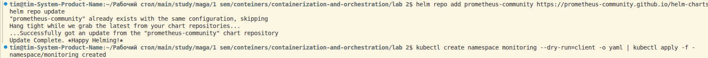

Создаю kps-values.yaml, который включает в себя пароль от Grafana и настройки для Prometheus Operator, которая отключает селектор, потому что иначе пришлось бы вручную писать лейблы для api.
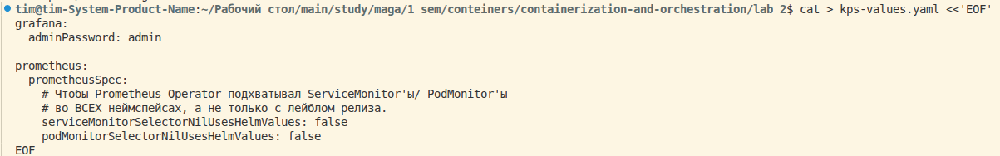

Устанавливаю чарт и проверяю, что все компоненты подняты:
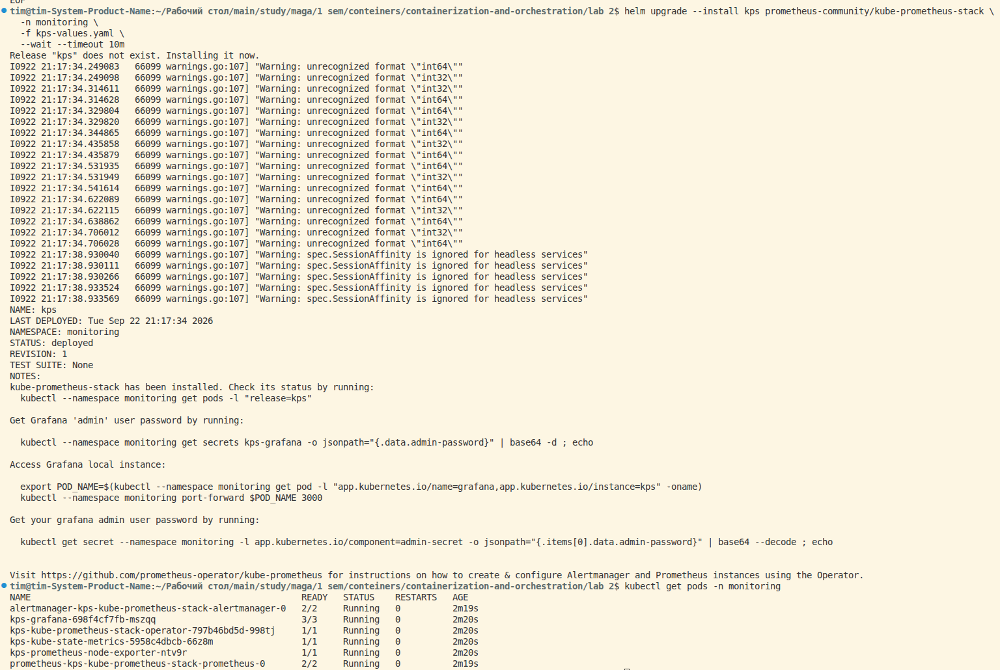

Открываю Prometheus UI и проверил, что он scrape'ит кластерные таргеты.
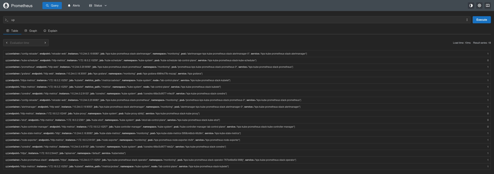
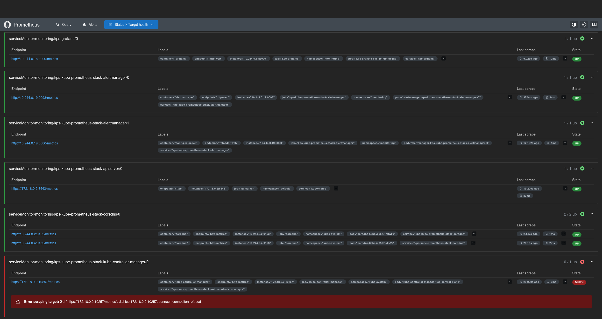

С Графаной было все не так просто: при первой попытке не получилось зайти на сайт: 
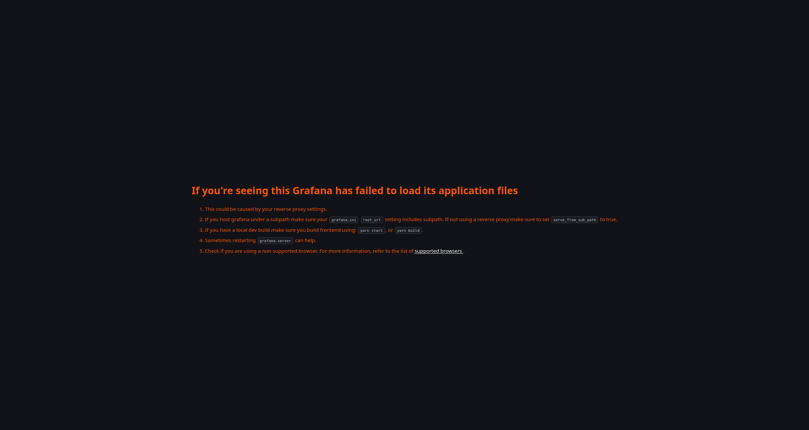
Не нашел качественного решения, с помощью нейронки понял, что ошибка на стороне браузера, но не смог ее устранить и просто открыл графану в приватном окне :)

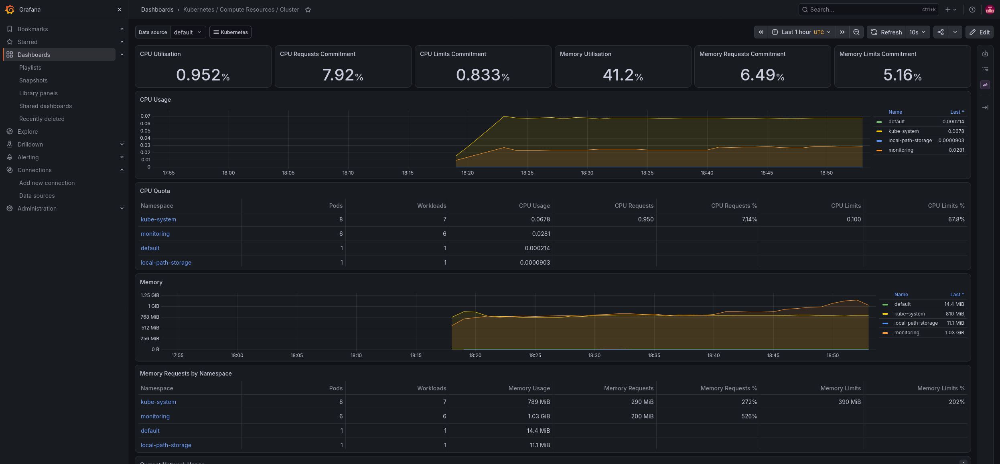

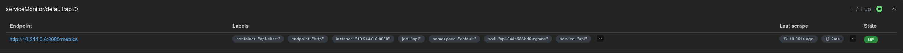
Состыковал Prometheus со своим api и теперь он может брать с api метрики. 

Не самая простая задачка разобраться с интерфейсом графаны, но даже что-то получилось.
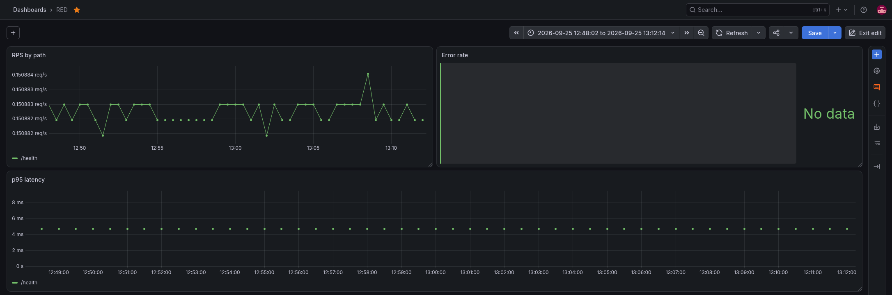
Теперь осталось наполнить это данными с помощью парочки циклов
```bash
kubectl port-forward svc/api 8080:8080
for i in $(seq 1 30); do curl -s http://localhost:8080/load; done &
for i in $(seq 1 10); do curl -s http://localhost:8080/fail; done
for i in $(seq 1 5);  do curl -s http://localhost:8080/slow; done
```
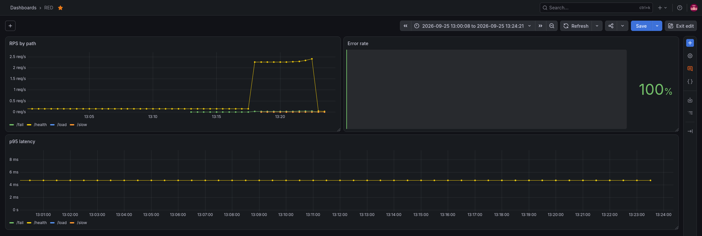
на графике p95 не увидел /slow, из-за значительного увеличения времени ответа от /healthy, поэтому решил испытать его отдельно 
```bash
for i in $(seq 1 20); do curl -s -o /dev/null http://localhost:8080/slow & done; wait
```
после команды результат стал заментным:
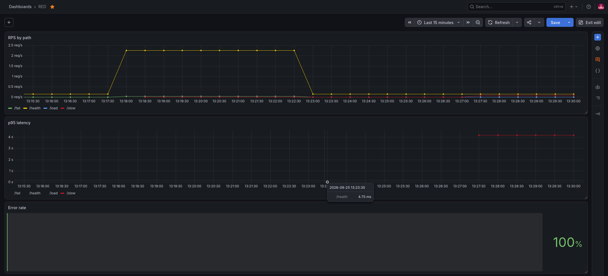