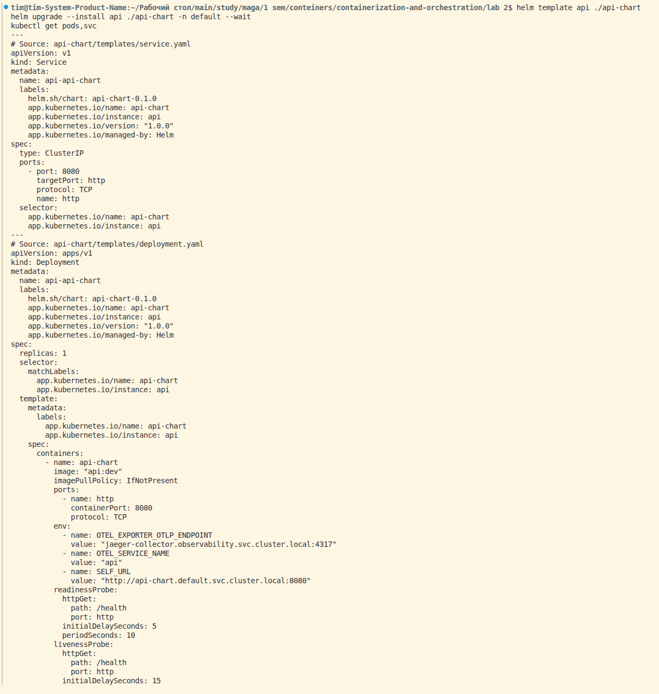
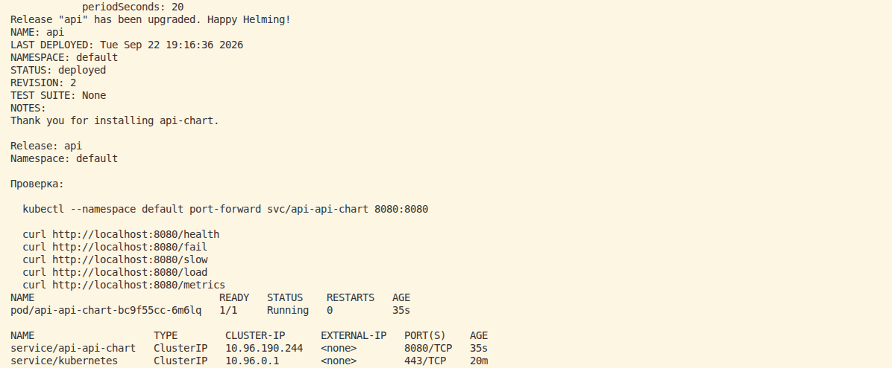
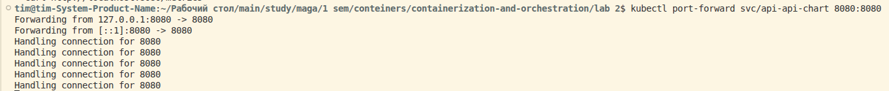
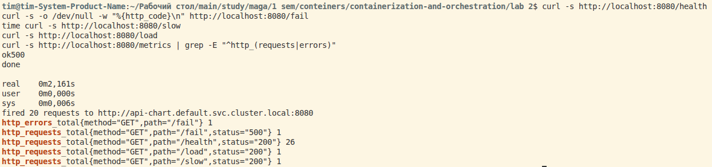

# Описание лабораторной работы
    !!! Дописать после завершения лабы !!!

# Ход работы
## Часть 0 - свой сервис
Успешно сгенерировал свой сервис :). Потом началось кое-что интересное. Ни разу не поднимал Кубер, а что такое Helm вообще не знаю (инетресно, что всегда, когда пишу Helm, хочу написать Help, надеюсь это никак не просьба о помощи, которая вертится у меня на подсознании...)

К сожалению, на этапе установки чарта консоль подвисла и я нажал на клавиатура, введя символ, и вся моя консоль с предыдущими командами улетела в стратосферу:


Поэтому часть команд приведу только в виде самих команд, без скриншотов, если это критично, то переделаю :(

Создал кластер:
``` bash
kind create cluster --name lab
kubectl config use-context kind-lab
kubectl get nodes
```
там был один узел со статусом Ready.

Собрал образ на основе Dockerfile.
``` bash
docker build -t api:dev .
docker images | grep api
```
Сначала начал сопротивляться этому пункту, потому что в описании 0 пункта говорится, что нельзя использовать docker compose, но потом понял, что создание образа на основе Dockerfile != использованию docker compose.

Загрузил полученный образ в кластер:
``` bash
kind load docker-image api:dev --name lab
```

Установил helm и создал Helm чарт сервиса... Куча каких-то файлов создалось, было непонятно, что это и зачем. Но потом вроде разобрался, вспомнил, как слушал лекции, которые посоветовали для тех, кто не знаком с Кубером. Вроде стало понятнее, но надо будет потом еще самому потыкаться...

``` bash
helm create api-chart
```

Установил chart. Та самая команда, которая сломала консоль :(

``` bash
helm template api ./api-chart
helm upgrade --install api ./api-chart -n default --wait
kubectl get pods,svc
```




Проверяю работоспособность эндпоинтов:




все эндпоинты подняты успешно и отдают метрики.

