# Описание лабораторной работы
    !!! Дописать после завершения лабы !!!

# Ход работы
## Часть 0 - свой сервис
Успешно сгенерировал свой сервис :). Потом началось кое-что интересное. Ни разу не поднимал Кубер, а что такое Helm вообще не знаю (инетресно, что всегда, когда пишу Helm, хочу написать Help, надеюсь это никак не просьба о помощи, которая вертится у меня на подсознании...)

К сожалению, на этапе установки чарта консоль подвисла и я нажал на клавиатура, введя символ, и вся моя консоль с предыдущими командами улетела в стратосферу:


Поэтому часть команд приведу только в виде самих команд, без скриншотов, если это критично, то переделаю :(

Создал кластер:
``` bash
kind create cluster --name lab
kubectl config use-context kind-lab
kubectl get nodes
```
там был один узел со статусом Ready.

Собрал образ на основе Dockerfile.
``` bash
docker build -t api:dev .
docker images | grep api
```
Сначала начал сопротивляться этому пункту, потому что в описании 0 пункта говорится, что нельзя использовать docker compose, но потом понял, что создание образа на основе Dockerfile != использованию docker compose.

Загрузил полученный образ в кластер:
``` bash
kind load docker-image api:dev --name lab
```

Установил helm и создал Helm чарт сервиса... Куча каких-то файлов создалось, было непонятно, что это и зачем. Но потом вроде разобрался, вспомнил, как слушал лекции, которые посоветовали для тех, кто не знаком с Кубером. Вроде стало понятнее, но надо будет потом еще самому потыкаться...

``` bash
helm create api-chart
```

Установил chart. Та самая команда, которая сломала консоль :(

``` bash
helm template api ./api-chart
helm upgrade --install api ./api-chart -n default --wait
kubectl get pods,svc
```
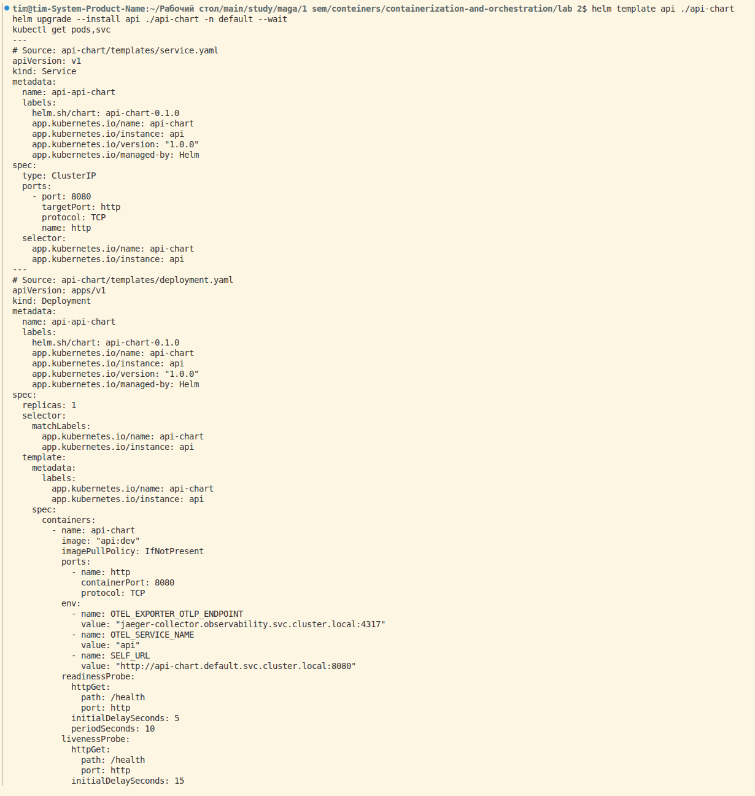
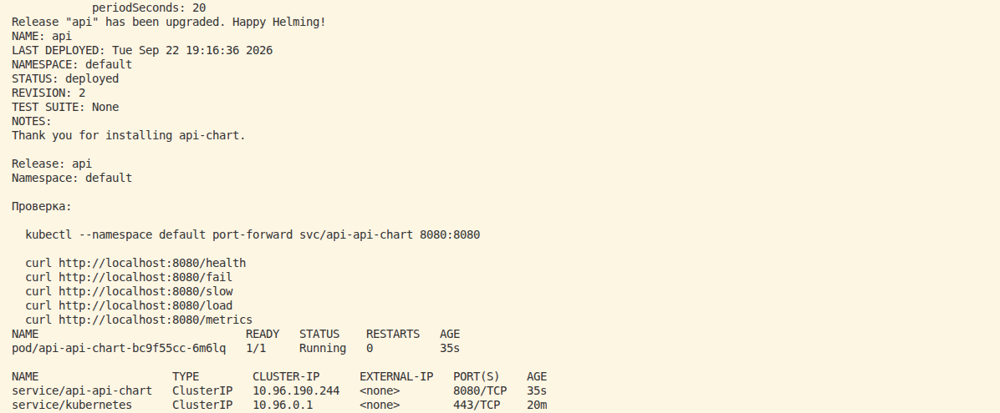


Проверяю работоспособность эндпоинтов:

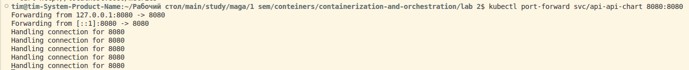

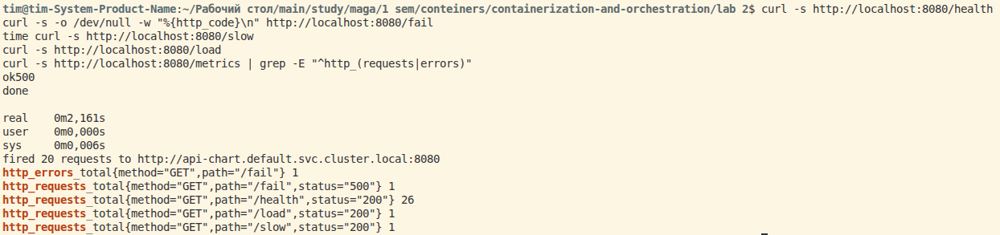
все эндпоинты подняты успешно и отдают метрики.

## Часть 1 - метрики
Создаю helm репозиторий:
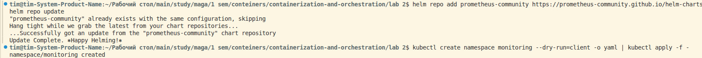

Создаю kps-values.yaml, который включает в себя пароль от Grafana и настройки для Prometheus Operator, которая отключает селектор, потому что иначе пришлось бы вручную писать лейблы для api.
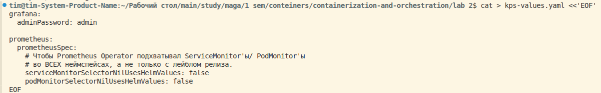

Устанавливаю чарт и проверяю, что все компоненты подняты:
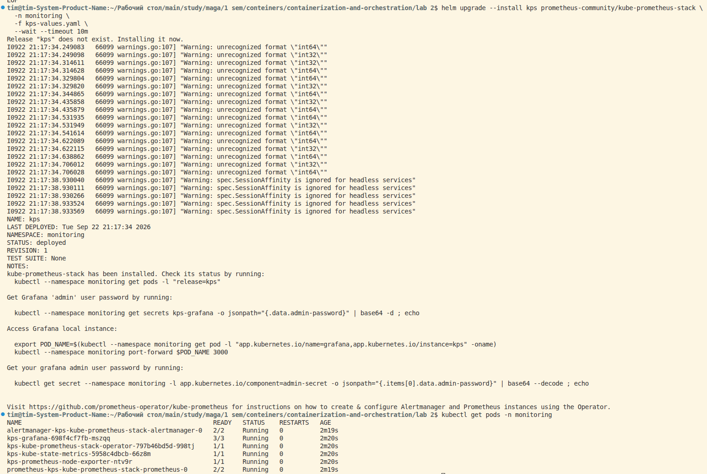

Открываю Prometheus UI и проверил, что он scrape'ит кластерные таргеты.
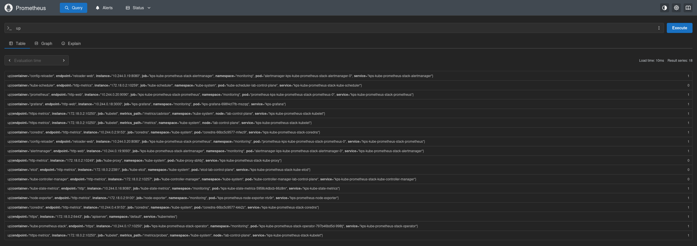
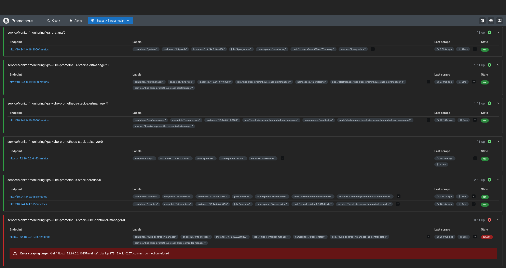

С Графаной было все не так просто: при первой попытке не получилось зайти на сайт: 
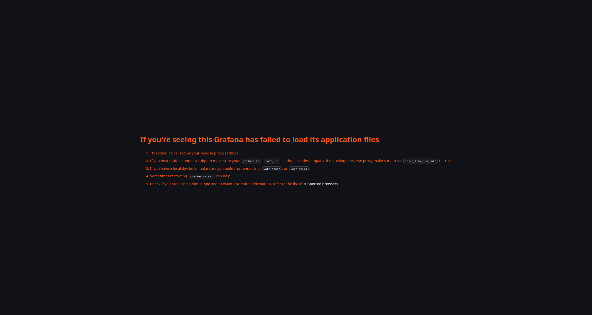
Не нашел качественного решения, с помощью нейронки понял, что ошибка на стороне браузера, но не смог ее устранить и просто открыл графану в приватном окне :)

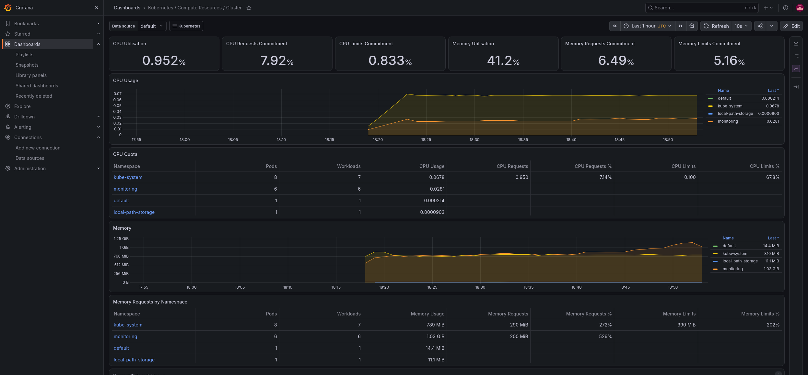

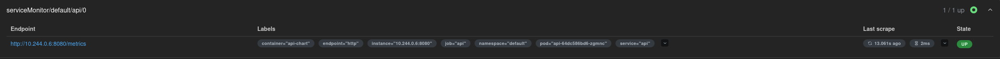
Состыковал Prometheus со своим api и теперь он может брать с api метрики. 

Не самая простая задачка разобраться с интерфейсом графаны, но даже что-то получилось.
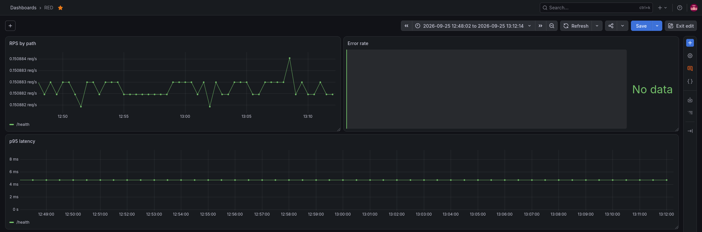
Теперь осталось наполнить это данными с помощью парочки циклов
```bash
kubectl port-forward svc/api 8080:8080
for i in $(seq 1 30); do curl -s http://localhost:8080/load; done &
for i in $(seq 1 10); do curl -s http://localhost:8080/fail; done
for i in $(seq 1 5);  do curl -s http://localhost:8080/slow; done
```
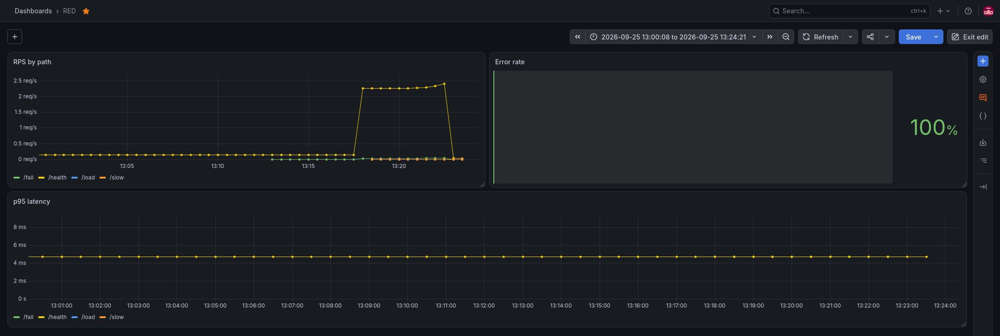
на графике p95 не увидел /slow, из-за значительного увеличения времени ответа от /healthy, поэтому решил испытать его отдельно 
```bash
for i in $(seq 1 20); do curl -s -o /dev/null http://localhost:8080/slow & done; wait
```
после команды результат стал заметным:
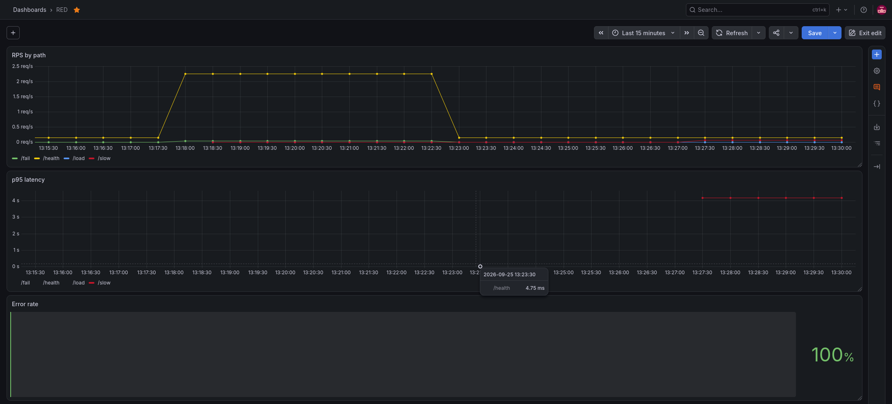

##Часть 2 — Логи (Loki + Grafana)
Первая попытка поднять Loki для нашей ноды оканчивается неуспехом. По умолчанию Loki пытался поставиться в масштабируемом режиме, для которого нужно внешнее объектное хранилище. Ошибка показана на скриншоте.
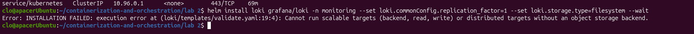

Дальше я попробовала переустановить Loki, только теперь уже с указанием необходимых флагов (тот же SingleBinary для решения проблемы масштабируемого режима). Я снова потерпела неудачу. Установщик требовал обязательно добавить флаг (useTestSchema). Как я поняла это система упрощенного хранения тестов для самого Loki (проверка что он работоспособен и корректно принимает логи). На скриншоте сообщение о недостающем флаге.
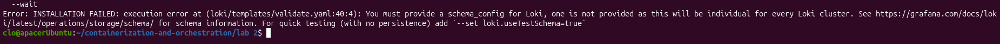

Тут можно увидеть что Loki успешно запустился и корректно работает в нашей системе. На это указывают 5 подов, которые находятся в состоянии "Running". Сразу ниже показано что агент Alloy точно также успешно запустился и работает. И еще чуть ниже показаны все процессы, что у нас стоит на нашей ноде.
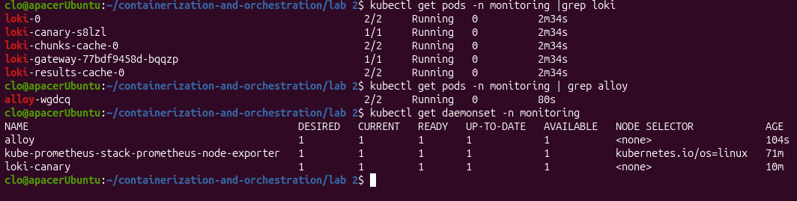

Создаю файл .alloy, где прописывается конфигурация для агента. 
```bash
discovery.kubernetes "pods" { role = "pod" } 
```
спрашивает у Kubernetes про все поды, существующие в кластере. 
```bash
loki.source.kubernetes "pods" { ... }
```
Непосредственно читает логи. targets для каждого пода забирает поток логов. forward_to говорит куда отправлять полученные логи.
```bash
loki.write "default" { ... }
```
Принимает логи и отправляет их уже по установленному url в Loki.

К сожалению в первую попытку произошла безграмотная опечатка - Kybernetes вместо Kubernetes. О чем мне сообщил терминал когда я попыталась получить логи с alloy.
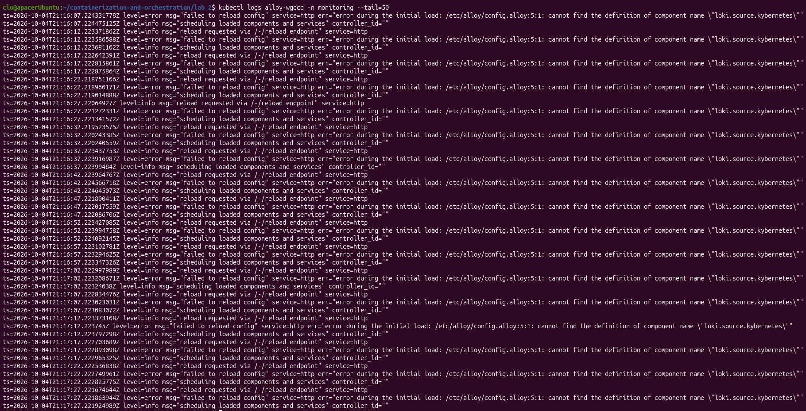

Исправление опечаток помогло, но не сильно. Теперь возникла ошибка - Loki не принимал логи, потому что в файле .alloy не была прописана метка организации. 
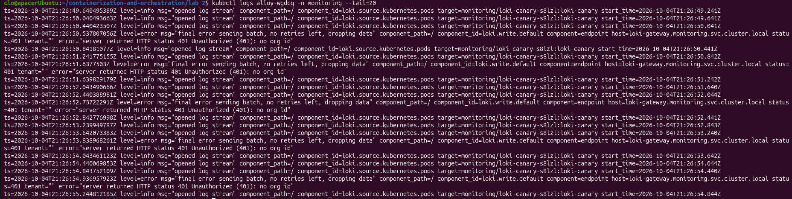

Поэтому я добавила строчку tenant_id = "fake", которая по сути является заглушкой для требовательного Loki. После этого все настроилось корректно. Вариант конфигурации агента я вынесла в отдельный файл alloy-config.alloy. Логи читаются и отправляются куда необходимо. Возникла другая проблема - при проверке через curl того, что отображается для лейбла api. Оказывается что в системе его не существует, и в логах выводился пустой результат, потому что лейбл назывался иначе.
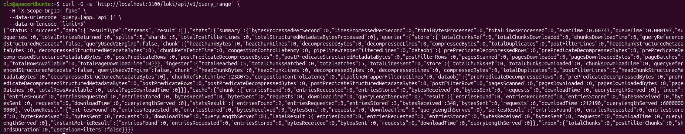

С помощью двух команд проверяю какие лейблы реально существуют в нашем Loki. У всех них было одно конкретное значние - loki.source.kubernetes.pods, а не имена подов. Поэтому результат вывода логов был пустым.
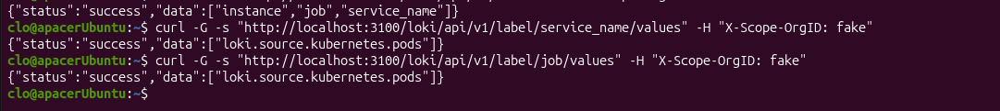

Исправляю файл .alloy, добавляя туда discovery.relabel "pod_logs" { targets = ... } с правилами переименования. Для каждого случая мы ставим красивое название. Например __meta_kubernetes_pod_name был назван просто pod. И так с каждым элементом. После этого на скриншоте показано что логи выводятся корректно, со всей необходимой информацией.
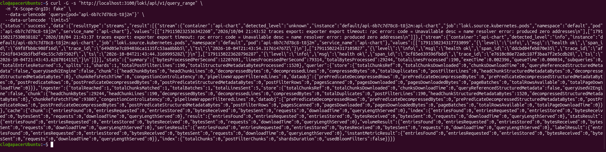

Успешное подключение Loki к Grafana. 
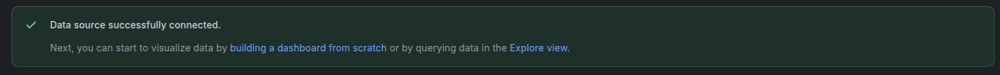

Вызов команды /fail. Для перестраховки вызвала его три раза... :)
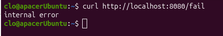

Поиск по ошибкам в Grafana, где четко видно три ошибки, которые я запускала через терминал.
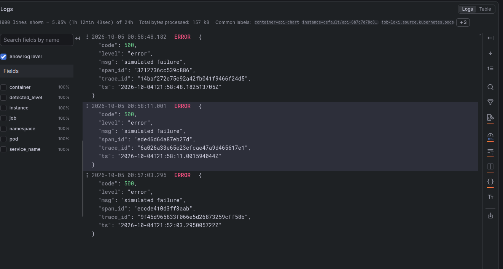

## Часть 4 - Алерты
Захотел алерты получать в телеграмме... Удобно ли это да, прибавило ли мне это сложностей, опрделенно да! Создал чат бота, потом группу, в которую добавил созданного бота. Чтобы не хранить токен бота где-то в коде или в values.yaml, сделал его секретным: 
```bash
kubectl create secret generic alertmanager-telegram \
  -n monitoring \
  --from-literal=bot-token='<Мой токен>'
```
первый пришедший алерт, успех, но это я еще не знаю, что меня ждет дальше...
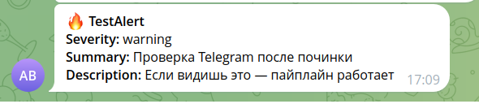

получилось принять алерт, ура. 
но в телеграмм валяться и другие алерты из kube-prometheus-stack
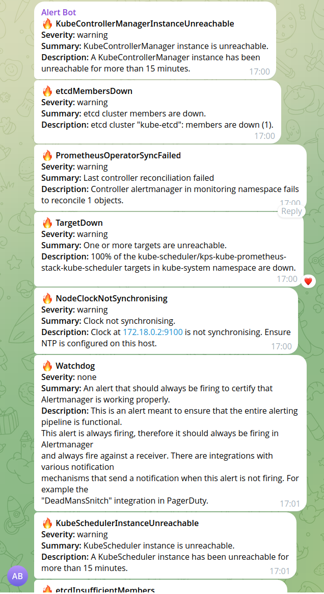 

добавил свои **действительно важные** алерты: p95 /health > 20 мс в течение 2 минут, доля ошибок выше 10% в течение 5 минут, up{job="api"} == 0 в течение 1-2 минут - сервис не отвечает 1-2 минуты.
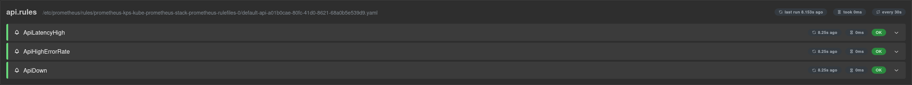

после очень долгих страданий, около 1.5 часов, получилось поймать свой алерт и прочитать его в телеграмме
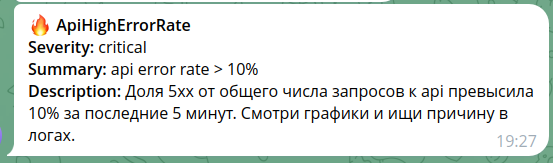

алерт также появился в карме

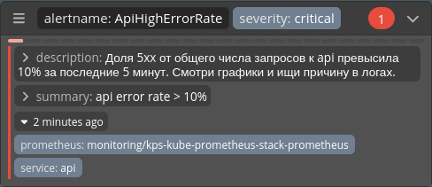
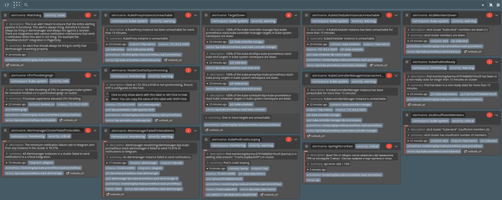

проблема была в том, что для отправки алертов в телеграмм нужен впн, а я его решил отключить. Сначала мучался с тем, чтобы понять это. Потом оказалось, что какие-то проблемы с DNS и пришлось лезть в настройки впн и там настраивать подключение к DNS. Но все заработало и уведомления теперь приходят мне в телеграмме
