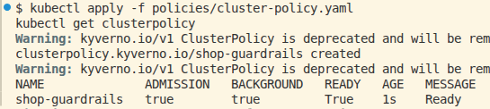
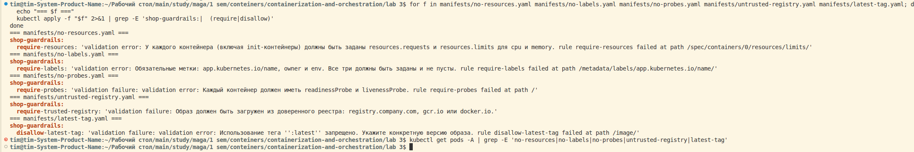

# Описание лабораторной работы №3 
!!! дописать в конце !!!

# Шаг 0 - Сервисы
Сгенерировал api и worker. Интересно выглядят, не примитивно, надо будет потом разобраться, что там вообще написано :)

Проверил, что все работает и поднимается с помощью временного docker-compose.

# Шаг 1 - Защита на кластер
Выбрал Kyverno, потому что yaml знаю и понимаю, а про Rego слышу впервые. Помимо этого Kyverno легко устанавливается. Единственным плюсом OPA / Gatekeeper нашел производительность за счет того, что Rego компилируемый язык, но как-то меня это не впечатлило на фоне сложности в том, чтобы разобраться в нем. 

Выбрал 5 правил для кластера:
- Обязательные лимиты и запросы ресурсов. Нужен, чтобы каждый контейнер в Pod имел свой requests и limit. Если правила нет, то один может съесть всю память сам. И вместо того, чтобы упал и перезапустился один под, упадет весь сервис. 
- Доверенный реестр образов. Правило ограничивает источники образов известными и контролируемыми.  
- Обязательные метки. С ними проще взаимодействовать с Pod'ами. Метки позволяют проще фильтровать объекты, строить NetworkPolicy, собирать метрики по приложению. 
- Запрет :latest. Тег latest - тег, который легко изменяется и строить на нем какую-то логику может быть небезопасно. 
- Readiness / liveness пробы обязательны. Пробы нужны для проверки работоспособности приложения.

запустил 5 манифестов, все 5 выдали по одной ошибке. Ниодного пода не создалось. После прогона `kubectl get pods -A | grep -E 'no-resources|no-labels|no-probes|untrusted-registry|latest-tag'` возвращает пустоту, значит не один из манифестов не попал в etcd. 
