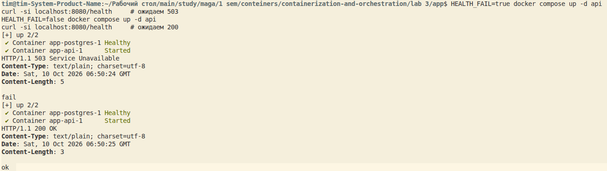

# Описание лабораторной работы №3 
!!! дописать в конце !!!

# Шаг 0 - Сервисы
Сгенерировал api и worker. Интересно выглядят, не примитивно, надо будет потом разобраться, что там вообще написано :)

Проверил, что все работает и поднимается с помощью временного docker-compose.

