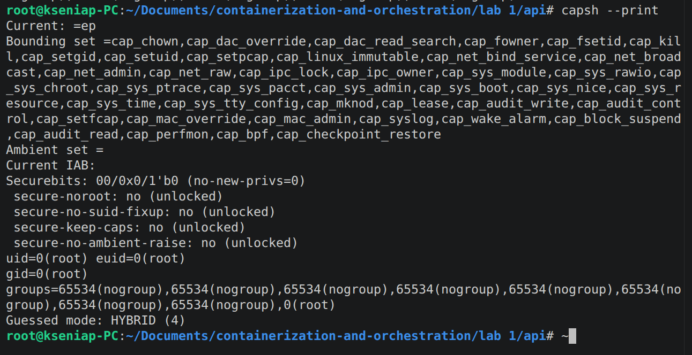
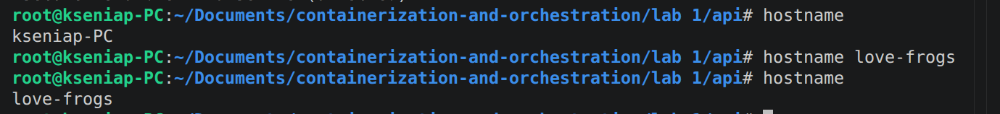
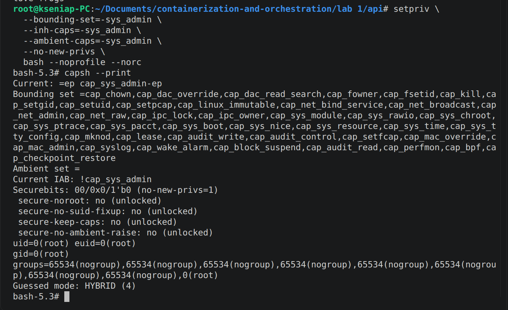
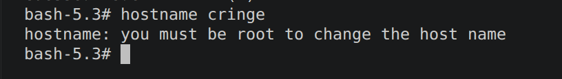
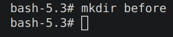
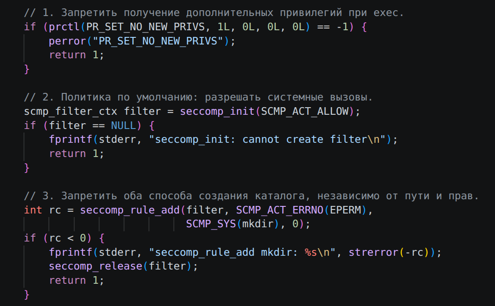
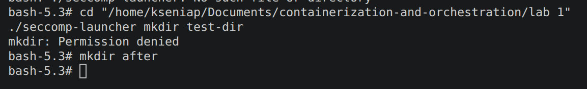
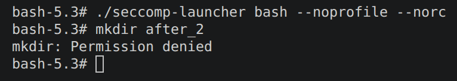
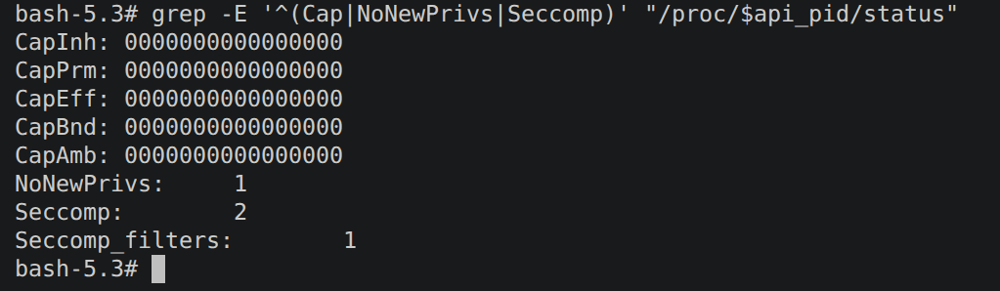

# История о том как я получала права...

Вообще с Capabilities разбиралась я долго, поскольку линукс я вижу первый раз, докер второй, а в подкапотные процессы лезть страшно больно и очень неприятно. Я наивно полагала, что ага, перечитаю конспекты с лекции и все будет понятно, но на деле все оказалось куда прозаичнее, так как на слайдах этому был посвящен один слайд, а когда я гуглила, начинали вылезать страшные вещи...

В теории мне вроде как все понятно, мол ага, у нас есть пользователь root, у которого есть очень очень много привелегий, и есть наш сервис, которому все привелегии давать опасно, поэтому мы даем лишь какие то, и бла бла бла. Ну и наша задача ограничить наш сервис в правах и это проверить. Вроде все ясно, но...

### Как??

Что писать в терминал чтобы это сделать, как вообще посмотреть доступные мне права, какие впринципе права надо ограничивать, я искренне не понимала...

Штош первым делом решила посмотреть какие права вообще доступны. Нарыла команду `getpcaps`. В официальной документации говорится

> The getpcaps is a small utility to show process capabilities. This may help better understanding the available Linux capabilities that are available to a running process. While the tool has some parameters, for its basic purpose it just requires a PID .

Ладно была не была, запускаю:

```text
kseniap@kseniap-PC:~/Documents/containerization-and-orchestration/lab 1$ getpcaps 36597
36597: cap_wake_alarm=i
```

Че то не то. Че то мало. Непорядок. Появилось ощущение что я все сделала неправильно и что я вообще дурочка. Стала разбираться - походу я действительно дурочка, и решила проверять права обычного процесса, не создав перед этим окружение через `unshare`...

Пупупу



тут я разобралась, создала оболочку, и решила посмотреть права. Открыла новую для себя команду, выводит кучу всего интересного. Мммммм многа буков.

Насколько я поняла, прав у меня внутри окружения куча, так как пока я ничего не ограничивала. Значит ли это что я могу сотворить любую дичь? Давайте попробуем

### Базированная база - пробую изменить имя хоста:



P.S. навеяно впечатлениями от лекции

Как видим, имя хоста менять мы можем. Теперь пробуем ограничить права

(здесь должна быть картинка Я вам запрещаю срать)



Тут я запрещаю срать, но пока несильно. Я исключила только право менять имя хоста. (Чтобы запретить все-все, надо писать `-all`, но так я побоялась почему то сделать)

Буков по прежнему много, но появилась строчка `Current IAB: !cap_sys_admin`, которая показывает права которые я исключила. Теперь снова попробуем изменить имя хоста

**Я ТВАРЬ ДРОЖАЩАЯ ИЛИ ПРАВО ИМЕЮ??**



На этом скрине видно что мы все таки твари дрожащие и прав не имеем, а значит задумка удалась, чему я бесконечно рада!

(на эту половину 4й части у меня ушло часа 4 если не меньше хахах)

## Итак, погнали страдать дальше. Seccomp.

Программа многие действия выполняет через обращения к ядру, хоть ту же смену хоста. Когда я меняла имя хоста, программа обращалась к ядру, и то отказывало, потому что не было прав. Seccomp же делает по другому, она впринципе запрещает такой системный вызов. И в отличие от Capabilities может запретить даже обычные действия пользователя

Я полезла разбираться с этим Seccomp, и поняла что самое простое - это написать лаучер-файл, описывающий наши запреты. Запрещать будет создание каталогов - `mkdir`



Проверяю - все ок, папка в корне тоже видна, честно-честно.

В самом лаунчер-файле написано примерно следующее



### Когда попыталась все это дело запустить возникла куча приколов.



Например вот тут я видимо навесила фильтр только на конкретное действие, а не на всю оболочку. А потом запустила это же действие в прежней оболочке без фильра и все сработало. Я так не хочу, я хочу запретить всем срать! (создавать папки) Пробую еще раз



## Если собрать все вместе будет:

```bash
unshare --pid --mount --net --uts --ipc --user --map-root-user --fork --mount-proc bash
setpriv \
  --bounding-set=-all \
  --inh-caps=-all \
  --ambient-caps=-all \
  --no-new-privs \
  bash --noprofile --norc
#тут все таки убираем все права а не одно как раньше
./seccomp-launcher bash --noprofile --norc
```

```bash
#после ограничений запускаем серсис из этой оболочки
ADDR=:8080 ./api/api &
api_pid=$!
```

```bash
#потом можно проверить работает ли он вообще и какие права в итоге у негоо есть
--nopcurl --noproxy '*' http://127.0.0.1:8080/health
grep -E '^(Cap|NoNewPrivs|Seccomp)' "/proc/$api_pid/status"s"
```

Получаем что прав нет, ну и вроде как мы в шоколаде


